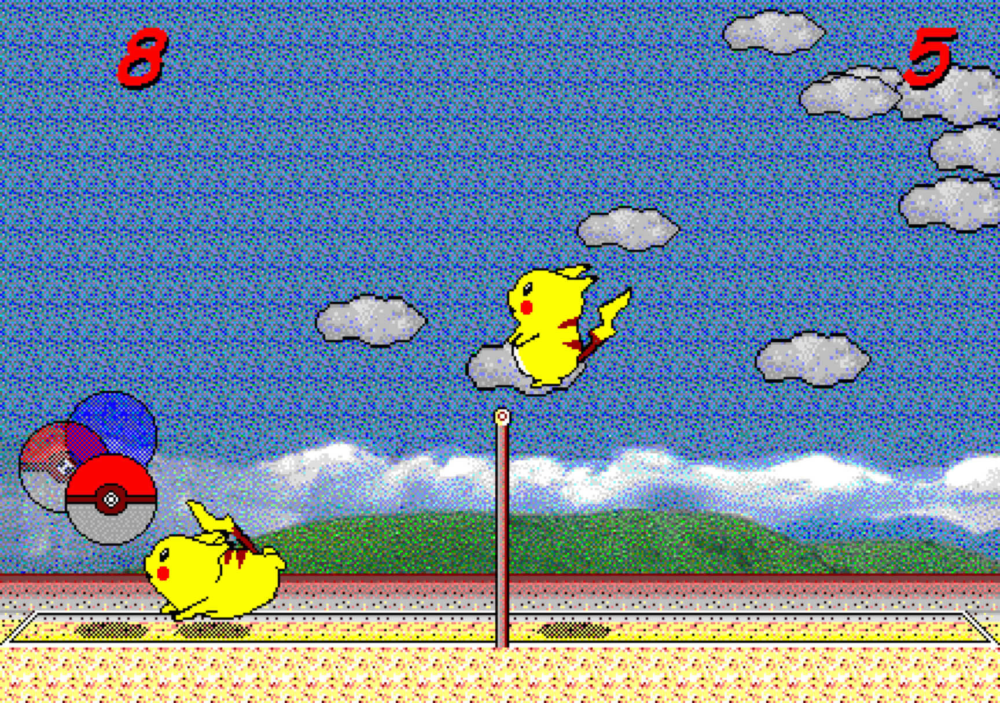

# 🏐 피카츄 배구 (Pikachu Volleyball)

HTML5 Canvas 기반 2D 피카츄 배구 게임입니다.



## 🎮 플레이 방법

| 키 | 동작 |
|----|------|
| ← → | 이동 |
| ↑ | 점프 |
| Space | 게임 시작 / 스파이크 / 재시작 |

## 🚀 실행

```bash
# 로컬 서버로 실행 (ES Module 사용)
npx serve .
# 또는
python3 -m http.server 8000
```

브라우저에서 `http://localhost:8000` 접속

## 📁 프로젝트 구조

```
├── index.html          # 진입점
├── src/
│   ├── config.js       # 게임 상수 (물리, 크기, 색상)
│   ├── input.js        # 키보드 입력 핸들러
│   ├── ball.js         # 공 엔티티
│   ├── pikachu.js      # 피카츄 엔티티 (P1 + AI)
│   ├── physics.js      # 충돌 감지 및 반사
│   ├── renderer.js     # Canvas 렌더링
│   ├── game.js         # 게임 상태 머신 + 루프
│   └── main.js         # 초기화
├── asset/
│   └── screenshot.png  # 레퍼런스 이미지
└── .kiro/              # AI-DLC 설정 (steering, hooks, agents, skills)
```

## 🏗️ 기술 스택

- HTML5 Canvas (순수 JavaScript, 외부 의존성 없음)
- ES Modules
- requestAnimationFrame 기반 게임 루프
- 델타 타임 프레임 독립적 물리

## 🤖 AI-DLC 개발 방식

이 프로젝트는 Kiro의 AI-DLC(AI Development Life Cycle) 방식으로 개발되었습니다:

- **Steering**: 게임 개발, TypeScript, Git, 보안 등 10개 모범 사례 규칙
- **Hooks**: 게임 에셋 검증, 로직 리뷰, 빌드 검증 등 15개 자동화 훅
- **Skill**: agent-harness (Plan→Execute→Evaluate→Evolve 프레임워크)
- **Agents**: pikachu-game 오케스트레이터 + game-planner/worker/evaluator 서브에이전트
