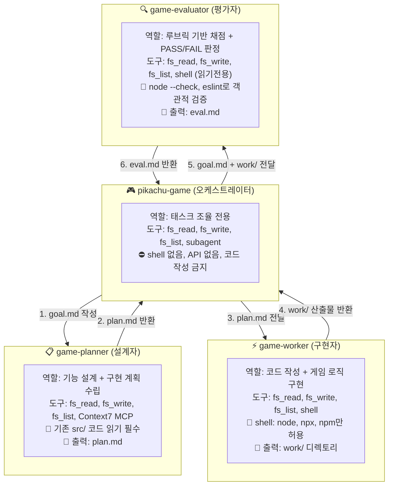
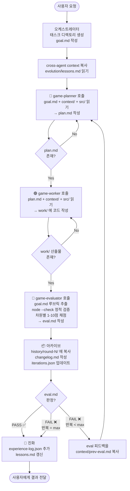
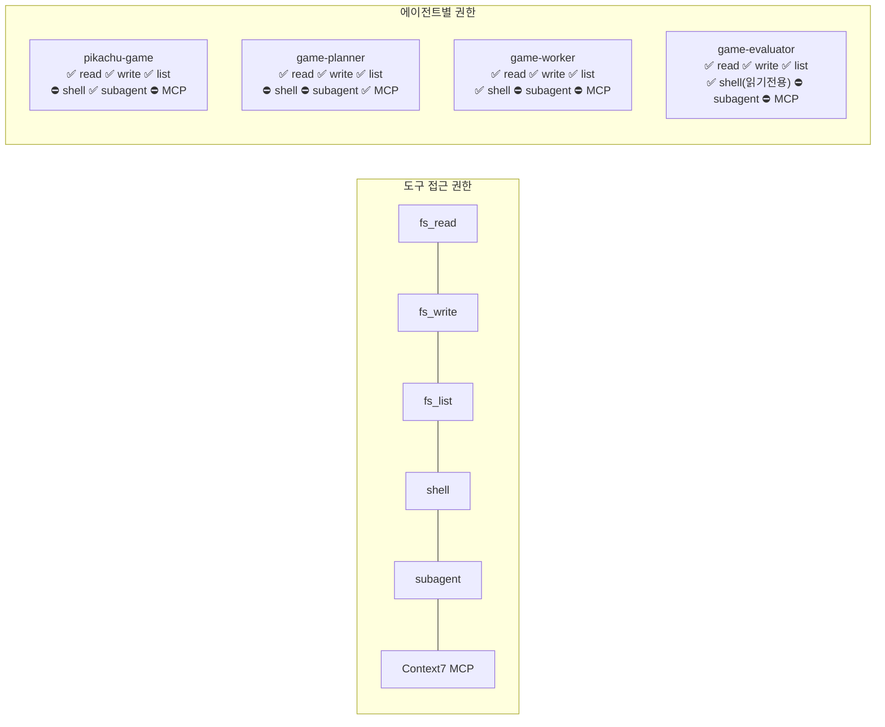
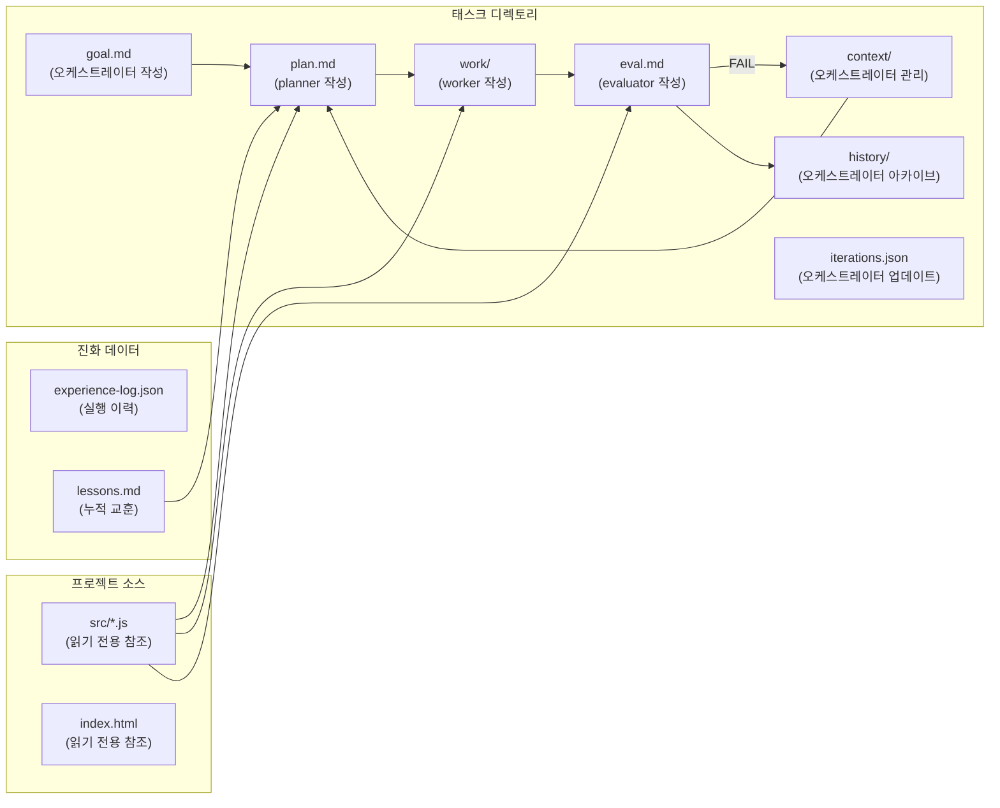
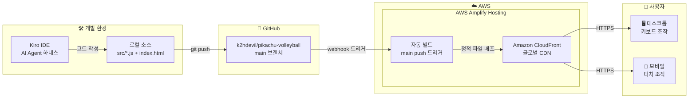
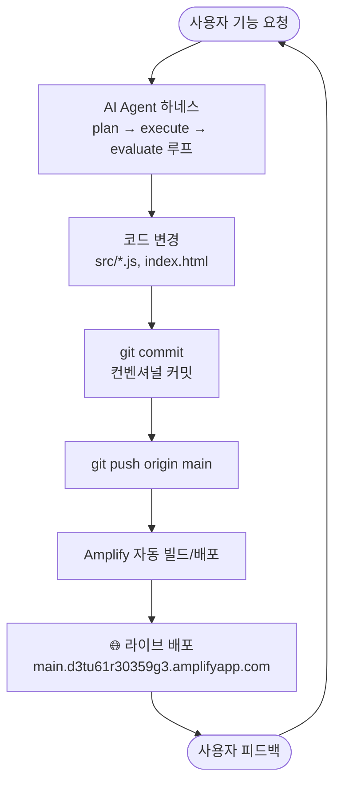

# 피카츄 배구 - AI Agent 하네스 아키텍처

## 에이전트 역할 구조

## 태스크 실행 루프

## 권한 분리 매트릭스

## 데이터 흐름

## 배포 아키텍처 (AWS Amplify Hosting)

**배포 정보:**
- 배포 URL: https://main.d3tu61r30359g3.amplifyapp.com/
- 소스: GitHub `k2hdevil/pikachu-volleyball` → `main` 브랜치
- 빌드 설정: Amplify 콘솔에서 구성
- 배포 방식: 정적 호스팅 (HTML + JS, 서버리스 백엔드 없음)
- CDN: CloudFront 자동 제공 (HTTPS, 글로벌 엣지 캐싱)
- 배포 트리거: `main` 브랜치에 push 시 자동 빌드 및 배포

## 전체 워크플로우 (개발 → 배포)

## 핵심 설계 원칙

| 원칙 | 설명 |
|------|------|
| 최소 권한 | 각 에이전트는 역할에 필요한 도구만 보유. 오케스트레이터는 shell/MCP 없음 |
| 관심사 분리 | 설계(planner) → 구현(worker) → 평가(evaluator) 완전 분리 |
| 객관적 검증 | evaluator가 node --check, eslint로 주관적 채점 전 객관적 검증 수행 |
| 반복 개선 | FAIL 시 eval 피드백을 context에 복사하여 다음 라운드에서 개선 |
| 진화 학습 | 매 태스크 완료 후 experience-log와 lessons.md에 교훈 누적 |
| 아카이브 의무화 | PASS/FAIL 무관하게 모든 라운드를 history/에 보존 |
| 회귀 방지 | evaluator가 전체 history/를 스캔하여 이전 수정사항의 회귀를 감지 |
